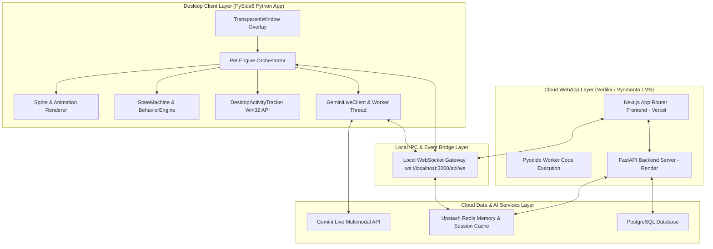
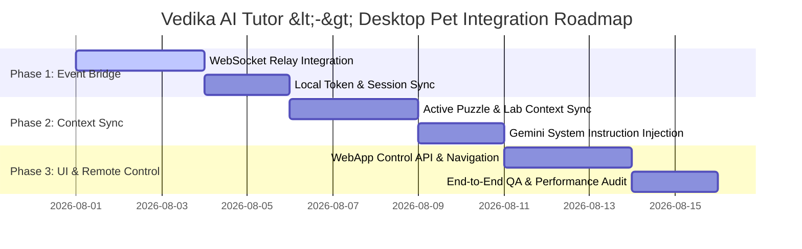

# Production-Grade System Architecture Document

## Seamless Integration of Vedika AI Tutor WebApp with Desktop Pet Companion

**Author/Maintainer:** Advanced AI Coding & Systems Architecture  
**Target Repository:** `c:\Users\seshu\desktop-pet`  
**Sub-Repository:** `c:\Users\seshu\desktop-pet\vedika\Vyomanta`  
**Date:** August 2026  
**Status:** Production-Ready Blueprint

---

## 1. Executive Summary

This architecture document defines the **end-to-end production integration** between the **Desktop Pet Companion** (a native PySide6 Windows desktop overlay app with Gemini Live voice capabilities) and the **Vedika AI Tutor WebApp** (a full-stack LMS & virtual lab platform hosted at `https://vyomanta-ai.vercel.app/` with Next.js frontend, Python FastAPI backend, and Pyodide WebWorker execution engine).

### Core Objectives

1. **Unified AI Persona**: Ensure Vedika maintains a singular, intelligent, stateful persona across both the Desktop Pet overlay and the Vedika WebApp LMS platform.
2. **Context-Aware Voice Tutoring**: Empower the Desktop Pet's Gemini Live voice engine with real-time context from the student's active web app session (active DSA code puzzles, course modules, virtual lab experiments, and past learning history).
3. **Bi-Directional Event Relay**: Establish a local, low-latency WebSocket / IPC event bridge allowing Desktop Pet to control web app navigation/actions and enabling the WebApp to trigger Desktop Pet animations (Chemistry Lab, Maths, Typing, Explaining, Music).
4. **Secure Single Sign-On (SSO)**: Provide token-based authentication and Upstash Redis memory synchronization between local desktop companion and cloud web services.

---

## 2. End-to-End System Architecture



---

## 3. Component Deep Dive

### 3.1 Desktop Pet Companion (`desktop-pet/`)

The Desktop Pet is a high-performance native desktop companion built on PySide6 and Python 3.

- **`main.py` & `TransparentWindow`**: Manages frameless, always-on-top window placement, drag/drop, scaling (0.5x - 2.0x), global hotkeys (`Alt+V` for voice chat, `F9` for pause/resume), and context menu.
- **`Pet` Orchestrator**: Ties together sprite loading, physics bounds, activity tracking, and state transitions.
- **`SpriteLoader` & Normalized Spritesheet**: Renders a master 18-column × 16-row WebP sprite sheet containing **277 normalized 432x596 frames** spanning 8 full animation sets (`talking`, `reading`, `chemistry`, `maths`, `music`, `typing`, `explaining`, `sleeping`).
- **`GeminiLiveClient`**: Real-time voice-to-voice streaming client connecting directly to Gemini Live API (`gemini-3.1-flash-live-preview`). Implements PyAudio 16kHz microphone capture, 24kHz speaker output, VAD (Voice Activity Detection), and Block NLMS echo cancellation.
- **`DesktopActivityTracker`**: Background Win32 process monitor tracking active foreground window titles with zero CPU overhead to auto-trigger pet animations (`VS Code` -> `typing`, `PhET/Lab` -> `chemistry`, `Desmos` -> `maths`, `YouTube` -> `music`).

### 3.2 Vedika AI Tutor WebApp (`vedika/Vyomanta/`)

The Vedika AI Tutor WebApp (`vyomanta-ai.vercel.app`) is an advanced LMS and Virtual Lab platform.

- **`frontend/` (Next.js App Router)**:
  - `CodePuzzle.jsx` & `Playground.jsx`: Interactive DSA puzzle solver and code sandbox.
  - `pyodide.worker.js`: WebWorker-based client-side Python execution engine.
  - `ResourcesDSACompanyWise.jsx` & `courses/`: Structured learning materials.
  - `virtual-labs/`: Interactive science & math simulation visualizers.
- **`backend/` (FastAPI + PostgreSQL + Redis)**:
  - Student authentication (JWT), course enrollment, puzzle submissions, analytics, and RAG vector search.

---

## 4. Integration Architecture: Desktop Pet <-> Vedika AI Tutor Access

To grant Desktop Pet seamless access to the Vedika AI Tutor WebApp, we implement a **4-Pillar Integration Model**:

```text
+-----------------------------------------------------------------------------------+
|                        4-PILLAR ACCESS INTEGRATION MODEL                          |
+---------------------------+---------------------------+---------------------------+
| 1. Session & Auth Sync    | 2. Event Bridge (IPC/WS)  | 3. Contextual Voice AI    |
| - OAuth2 / Token Sharing  | - WebSocket Event Relay   | - Real-time Page Context  |
| - Redis Shared Memory     | - Action Dispatcher       | - Multimodal Prompting    |
+---------------------------+---------------------------+---------------------------+
|                     4. Direct Control & Navigation Interface                      |
|                     - Cross-launch URLs & Virtual Labs                            |
|                     - Remote Code & Puzzle Assist                                 |
+-----------------------------------------------------------------------------------+
```

### Pillar 1: Session & Authentication Synchronization

- **Shared Token Store**: When a student logs into the Vedika WebApp, the browser stores an encrypted auth token in `localStorage`.
- **Local WebSocket Auth Handshake**: The Desktop Pet connects to `ws://localhost:3000/api/ws` and passes the user token.
- **Shared Upstash Redis Cache**: Both WebApp and Desktop Pet query `memories:{user_id}` and `chat:{session_id}` in Upstash Redis, enabling the pet to remember the student's name, enrolled courses, weak topics, and recent puzzle attempts.

### Pillar 2: Bi-Directional Event Relay (WebSocket Specification)

The WebSocket bridge enables real-time messaging between Vedika WebApp and Desktop Pet:

```json
// Example: WebApp -> Desktop Pet (Student started Chemistry Lab)
{
  "event": "WEBAPP_ACTIVITY_CHANGED",
  "payload": {
    "activity": "chemistry_lab",
    "course_id": "chem-101",
    "lab_title": "Acid-Base Titration Visualizer",
    "user_id": "usr_98234"
  }
}
```

```json
// Example: Desktop Pet -> WebApp (Pet triggers hint on current puzzle)
{
  "event": "PET_ACTION_REQUESTED",
  "payload": {
    "action": "TRIGGER_PUZZLE_HINT",
    "target": "CodePuzzle",
    "hint_level": 1
  }
}
```

#### Event Mapping Matrix

| Trigger Source | Event | Desktop Pet Reaction | Vedika WebApp Reaction |
| :--- | :--- | :--- | :--- |
| **WebApp** | Student opens DSA Puzzle | Switches to `typing` animation | Desktop Pet bubble: *"Ready to solve this puzzle?"* |
| **WebApp** | Student opens Chem Lab | Switches to `chemistry` animation | Companion enters Virtual Lab Mode |
| **WebApp** | Student stuck for > 2 mins | Switches to `explaining` animation | Pet offers voice hint via Gemini Live |
| **Desktop Pet** | User double-clicks Pet | Plays `wave` animation | Opens `vyomanta-ai.vercel.app` in default browser |
| **Desktop Pet** | Voice command *"Open Chemistry Lab"* | Speaks confirmation | Navigates WebApp to `/labs/chemistry` |

### Pillar 3: Context-Injected Voice Tutoring

When `Alt+V` voice chat is activated on Desktop Pet, `GeminiLiveClient` dynamically injects the student's active Vedika WebApp context into Gemini's system instructions:

```python
# Context Injection Blueprint inside engine/gemini_live.py
system_instruction = f"""
You are Vedika, an intelligent AI tutor companion.
The student is currently active on the Vedika LMS WebApp.
Active Context:
- Current Page: {active_page_title}
- Active Subject: {tutor_subject}
- Active Code / Puzzle: {active_puzzle_code}
- Student Sentiment: {sentiment_label}
- Past Memories: {upstash_memory_summary}

Be concise, encouraging, and clear. Help the student step-by-step without giving away full answers outright.
"""
```

### Pillar 4: Navigation & Remote Control Interface

Desktop Pet exposes a unified control interface `open_url_by_gemini(url)` and IPC API to interact with Vedika WebApp:

1. **Direct Web Launch**: Opens specific routes like `https://vyomanta-ai.vercel.app/courses`, `/labs/chemistry`, `/resources/dsa`.
2. **Auto-Voice Disconnect on Media**: Automatically pauses Gemini Live voice streaming when video tutorials or YouTube media play to eliminate audio interference.

---

## 5. Security & Data Privacy Guidelines

1. **Local IPC Isolation**: The WebSocket server (`server-with-ws.js`) binds exclusively to `localhost` (`127.0.0.1`), ensuring external network requests cannot access local desktop control APIs.
2. **API Key Security**: Gemini API keys are loaded via environment variables (`.env`) and never hardcoded in source files.
3. **Data Encryption**: All communication between Desktop Pet / WebApp and cloud services uses TLS 1.3 (`https://`, `wss://`).

---

## 6. Implementation Roadmap



### Phase 1: Event Bridge Setup (Days 1–5)

- Standardize WebSocket JSON message definitions in `server-with-ws.js`.
- Enable local port discovery (`ws://127.0.0.1:3000/api/ws`) in PySide6 `main.py`.

### Phase 2: Context & Memory Sync (Days 6–10)

- Connect Upstash Redis memory retrieval to Desktop Pet's `GeminiLiveClient`.
- Transmit active code snippet and puzzle metadata from Next.js `CodePuzzle.jsx` to Desktop Pet.

### Phase 3: Remote Action Dispatcher & QA (Days 11–15)

- Enable voice-triggered actions (e.g., *"Show solution hint"*, *"Open virtual chemistry lab"*).
- Conduct performance, latency, and memory profiling across Windows desktop environments.

---

## 7. Verification & Health Monitoring

To verify the integration in production:

1. Run `python main.py` in `c:\Users\seshu\desktop-pet`.
2. Start the local server `node server-with-ws.js`.
3. Open `https://vyomanta-ai.vercel.app/` in browser.
4. Verify:
   - Pet switches to `typing` animation when entering Code Puzzle.
   - Pet switches to `chemistry` animation when launching Chemistry Virtual Lab.
   - Pressing `Alt+V` speaks with full context of current web app activity.
