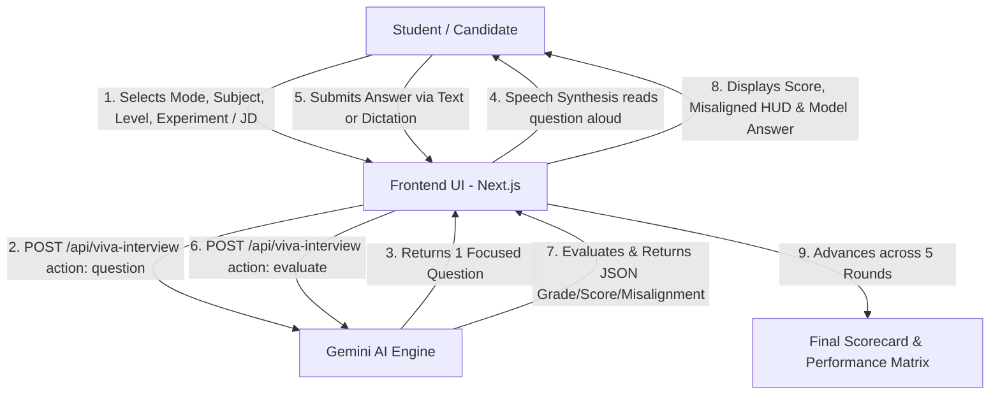

# Comprehensive Technical & Managerial Audit Report: AI Viva, Technical Interview & Voice Examiner System

**Project:** Vyomanta / Vedika LMS  
**Component:** AI Viva Examiner & Technical Job Interview Hub  
**Target Audience:** Engineering Leadership, Product Managers, and Stakeholders  

---

## 1. Executive Summary

The **Vyomanta AI Examination & Voice Tutor System** is an automated, voice-enabled oral exam and mock interview platform. Designed to replicate human evaluators (such as academic professors or senior technical interviewers), the platform conducts real-time Q&A sessions, speaks questions aloud, analyzes student answers, detects conceptual misconceptions, provides scoring metrics, and outlines actionable feedback for continuous learning.

---

## 2. High-Level Architecture & Workflow



---

## 3. Core Capabilities & Mechanics

### A. Academic Viva & Technical Interview Modes
1. **Academic Viva**:
   - **Supported Subjects**: Physics, Chemistry, Biology, Computer Science, Mathematics.
   - **Experiment Presets**: Ohm's Law, Compound Pendulum, Young's Double Slit, Acid-Base Titration, Salt Analysis, Binary Search Trees, Matrix Eigenvalues, etc., or user-defined experiments.
   - **Academic Tiers**: School (K-12), College (Undergraduate B.Tech/B.Sc), and Postgraduate/Research.
2. **Technical Job Interview**:
   - **Supported Stacks**: Python, JavaScript, Java, C++, SQL, Systems & Cloud Architecture.
   - **Custom JD Support**: Users can paste any custom Job Description (JD) to trigger role-tailored questions.
   - **Seniority Tiers**: Junior / Entry-Level, Mid-Level, and Senior / Tech Lead.

---

### B. Dynamic Question Generation
* **Endpoint**: `POST /api/viva-interview` (`action: "question"`)
* **AI Model**: Google **Gemini 2.5 Flash** (`gemini-2.5-flash`).
* **Multi-Turn Context Tracking**: The system maintains the session history (`question`, `answer`, and `score`) across rounds so subsequent questions adapt to the candidate's demonstrated knowledge depth.

---

### C. Voice & Speech Synthesis
* **Speech Output**: Utilizes the browser's native **Web Speech Synthesis API** (`window.speechSynthesis`) to vocalize questions aloud, simulating a live viva examiner.
* **Live Audio Tutor Alternative**: Integrates a full-duplex WebSocket server (`voice-server.js`) streaming raw 16kHz PCM audio to Gemini Live Preview (`gemini-3.1-flash-live-preview`) with real-time sentiment analysis (English, Hindi, Telugu) and 3D mascot animations.

---

### D. Objective Scoring, Misalignment Detection & Feedback
* **Endpoint**: `POST /api/viva-interview` (`action: "evaluate"`)
* **JSON Schema Enforcement**: Gemini grades responses using structured JSON:

```json
{
  "grade": "A | B | C | D | F",
  "score": 8,
  "isMisaligned": false,
  "misalignedReason": "Explanation of any factual or conceptual errors",
  "rectificationPrompt": "Targeted hint prompting the student to correct the mistake",
  "correctAnswer": "Complete reference model answer",
  "explanation": "Critique of what was accurate vs. missed",
  "improvementTip": "Actionable advice for mastery"
}
```

* **Misaligned Answer Rectification HUD**: When `isMisaligned: true` is flagged, an amber warning banner highlights the misconception and prompts the candidate with a guided rectification hint.

---

### E. Multi-Round Progress & Session Scorecard
* Each session conducts **5 targeted questions**.
* At completion, the candidate receives a **Final Evaluation Summary Matrix** logging every question, submitted answer, awarded score (0–10), grade, and rectified concepts.

---

## 4. Key Files & Code Locations

| Component | File Path | Primary Functionality |
| :--- | :--- | :--- |
| **Viva UI Page** | [`frontend/app/viva-interview/page.jsx`](file:///e:/vyomantha/vyomanta-pet/bot-v2/Vedika/vedika/Vyomanta/frontend/app/viva-interview/page.jsx) | Interactive UI, mode selectors, audio controls, evaluation HUD, and scorecard |
| **Viva AI Route** | [`frontend/app/api/viva-interview/route.js`](file:///e:/vyomantha/vyomanta-pet/bot-v2/Vedika/vedika/Vyomanta/frontend/app/api/viva-interview/route.js) | Gemini 2.5 Flash prompt engineering, JWT auth, and JSON schema evaluation |
| **Voice Server** | [`frontend/voice-server.js`](file:///e:/vyomantha/vyomanta-pet/bot-v2/Vedika/vedika/Vyomanta/frontend/voice-server.js) | WebSocket server for low-latency bidirectional PCM voice chat & sentiment tracking |
| **Voice Agent View** | [`frontend/components/voice-tutor/VoiceAgentView.jsx`](file:///e:/vyomantha/vyomanta-pet/bot-v2/Vedika/vedika/Vyomanta/frontend/components/voice-tutor/VoiceAgentView.jsx) | Live microphone capture, audio queue playback, and session persistence |
| **Mascot Visualizer** | [`frontend/components/voice-tutor/VoiceRobotVisualizer.jsx`](file:///e:/vyomantha/vyomanta-pet/bot-v2/Vedika/vedika/Vyomanta/frontend/components/voice-tutor/VoiceRobotVisualizer.jsx) | Dynamic canvas mascot displaying facial expressions based on sentiment |
| **Auth & Security** | [`frontend/lib/auth.js`](file:///e:/vyomantha/vyomanta-pet/bot-v2/Vedika/vedika/Vyomanta/frontend/lib/auth.js) & [`frontend/lib/keys.js`](file:///e:/vyomantha/vyomanta-pet/bot-v2/Vedika/vedika/Vyomanta/frontend/lib/keys.js) | JWT verification and round-robin Gemini API key rotation |

---

## 5. Security & Infrastructure Highlights

1. **Authentication**: All endpoints require a valid JWT token signed with HMAC SHA-256 (`verifyJwt`).
2. **API Key High-Availability**: Automatic round-robin rotation across multiple Gemini API keys prevents quota bottlenecks during concurrent sessions.
3. **Session Continuity**: Multi-session history backed by Upstash Redis (`chat:<sessionId>` / `memories:<userId>`) and browser localStorage.
