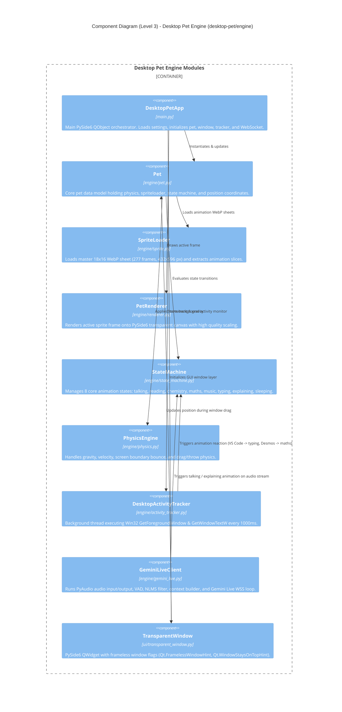
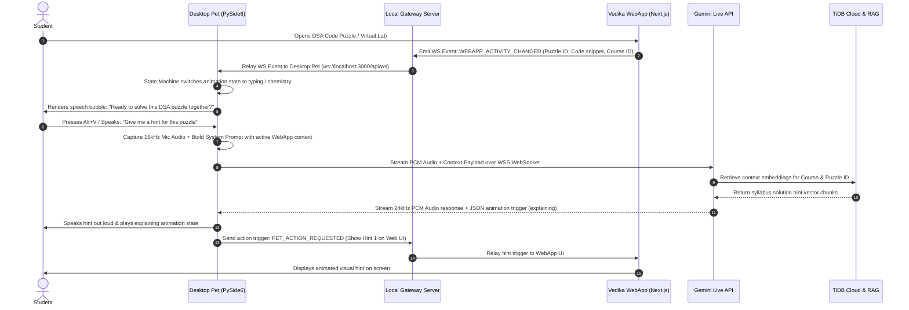

# C4 Model System Architecture: Vedika AI Tutor & Desktop Pet Ecosystem

> **Project Root:** `c:\Users\seshu\desktop-pet`  
> **Sub-Repository:** `c:\Users\seshu\desktop-pet\vedika\Vyomanta`  
> **Format:** C4 Model Specification (Levels 1–4) & Production Architecture Reference  
> **Target Extensions:** C4X, C4-PlantUML, Structurizr DSL  

---

## 1. Executive Summary & C4 Model Overview

This document presents the complete **C4 Model Architecture** for the **Vedika AI Tutor & Desktop Pet Ecosystem**. The system unifies a high-performance native desktop companion overlay (**Desktop Pet**, built with PySide6 Python) and a cloud-hosted Learning Management System (**Vedika / Vyomanta LMS WebApp**, built with Next.js 14, Python FastAPI, Pyodide WASM, and TiDB Cloud Vector DB).

The C4 Model breaks down the system into 4 distinct architectural abstraction levels:
1. **Level 1: System Context Diagram** – High-level actors, systems, external cloud AI models, and infrastructure.
2. **Level 2: Container Diagram** – Software applications, data stores, API runtimes, and IPC gateways.
3. **Level 3: Component Diagram** – Internal module architecture of the Desktop Pet engine and Vedika WebApp.
4. **Level 4: Dynamic & Sequence Diagram** – Bi-directional voice AI tutoring, context injection, and IPC event relay flows.

---

## 2. Level 1: System Context Diagram (C4 Context)

The System Context diagram illustrates how the **Student** and **Course Administrator** interact with the **Desktop Pet Overlay** and **Vedika LMS WebApp**, as well as the external AI services and cloud infrastructure.

```mermaid
C4Context
    title System Context Diagram (Level 1) - Vedika AI Tutor & Desktop Pet Ecosystem

    Person(student, "Student / Learner", "Interacts with Desktop Pet companion and Vedika WebApp to learn science, math, and coding.")
    Person(admin, "Course Administrator", "Manages course syllabus, quizzes, and learning materials via the Admin Console.")

    System(desktop_pet, "Desktop Pet Overlay Companion", "Native PySide6 desktop overlay providing frameless mascot, desktop activity tracker, real-time Gemini Live voice AI, and IPC event relay.")
    System(local_bridge, "Local Event Bridge & Gateway", "Node.js WebSocket gateway (ws://localhost:3000/api/ws) bridging local desktop events and web sessions.")
    System(vedika_webapp, "Vedika AI Tutor WebApp", "Next.js 14 LMS platform (vyomanta.vercel.app) with 3D Virtual Science Labs, Pyodide WASM sandbox, and RAG search.")

    System_Ext(gemini_live, "Google Gemini 3.1 Live API", "Real-time bidirectional 16kHz/24kHz PCM audio voice streaming via WebSockets.")
    System_Ext(gemini_flash, "Google Gemini 2.5 Flash & Embeddings", "RAG vector retrieval (text-embedding-004) and context-augmented answer generation.")
    System_Ext(cloud_infra, "Cloud Data Infrastructure", "TiDB Cloud Vector DB, Upstash Redis Memory Cache, Cloudflare R2 Object Storage.")

    Rel(student, desktop_pet, "Interacts via drag/drop, speech, and Alt+V hotkey")
    Rel(student, vedika_webapp, "Solves DSA puzzles, runs 3D labs, views courses")
    Rel(admin, vedika_webapp, "Edits syllabus, quizzes, and lessons")

    Rel_Bi(desktop_pet, local_bridge, "Exchanges real-time user state & action triggers")
    Rel_Bi(vedika_webapp, local_bridge, "Relays active page context & receives remote commands")

    Rel(desktop_pet, gemini_live, "Streams audio & active screen/page context")
    Rel(vedika_webapp, gemini_flash, "Performs RAG query augmentation")
    Rel(vedika_webapp, cloud_infra, "Reads/writes LMS data, session cache & vector embeddings")
    Rel(local_bridge, cloud_infra, "Synchronizes session memory tokens")
```

---

## 3. Level 2: Container Diagram (C4 Container)

The Container diagram zooms into the **Vedika Ecosystem boundary**, detailing the runtime containers, databases, and gateways.

```mermaid
C4Container
    title Container Diagram (Level 2) - Vedika AI Tutor & Desktop Pet Architecture

    System_Boundary(c1, "Desktop Pet Client Overlay (PySide6 / Python 3)") {
        Container(gui_win, "TransparentWindow UI", "PySide6 Qt6", "Frameless, always-on-top transparent Qt window managing pet placement, drag events, and hotkeys.")
        Container(pet_core, "Pet Engine Orchestrator", "Python 3 (pet.py)", "Coordinates pet state, physics, rendering loops, state machine, activity tracking, and voice engine.")
        Container(renderer, "Sprite & Animation Renderer", "PySide6 QPainter", "Renders 277 WebP sprite frames across 8 animation sets (talking, reading, chemistry, maths, music, typing, explaining, sleeping).")
        Container(state_mgr, "StateMachine & Behavior Engine", "Python 3", "Manages animation state transitions, idle behaviors, and reaction triggers.")
        Container(act_tracker, "Desktop Activity Tracker", "Win32 API / ctypes", "Monitors active foreground window titles with zero CPU overhead to react to active user tools (VS Code, Desmos, YouTube).")
        Container(voice_engine, "Gemini Live Voice Client", "Python / PyAudio / WebSockets", "Handles 16kHz mic capture, 24kHz speaker playback, VAD, NLMS echo cancellation, and prompt context injection.")
        Container(ws_ipc, "Local WS IPC Client", "PySide6 QWebSocket", "Connects Desktop Pet to local event bridge gateway.")
    }

    System_Boundary(c2, "Local IPC Gateway (Node.js)") {
        Container(ws_gateway, "WebSocket Gateway Server", "Node.js / Express (server-with-ws.js)", "Runs on ws://localhost:3000/api/ws. Relays events between Pet overlay and WebApp.")
    }

    System_Boundary(c3, "Vedika WebApp LMS Platform (Vercel & Render)") {
        Container(next_frontend, "Next.js 14 App Router Frontend", "React 18 / Tailwind / Three.js", "Renders LMS dashboard, course syllabus, 3D science labs, and interactive code puzzles.")
        Container(pyodide_worker, "Pyodide WASM Worker Engine", "Pyodide Web Worker", "Compiles and executes Python code safely inside isolated client browser sandbox.")
        Container(backend_api, "FastAPI & Frappe LMS API Server", "Python FastAPI / Docker", "Handles JWT Auth, course CRUD, quiz grading, and multi-tenant RAG vector search.")
    }

    System_Boundary(c4, "Cloud Data & AI Infrastructure") {
        ContainerDb(tidb_db, "TiDB Cloud Vector Database", "TiDB / MySQL", "Stores relational LMS data and HNSW 768-dim vector embeddings (idx_embedding).")
        ContainerDb(redis_cache, "Upstash Redis", "Redis Cache", "Stores global session memory, rate limiting, and pub/sub channels.")
        ContainerDb(r2_assets, "Cloudflare R2 Object Storage", "S3 Storage", "Hosts video lectures and media assets served via 5-minute pre-signed URLs.")
        Container(gemini_live_ext, "Gemini 3.1 Live API", "Google Cloud", "Real-time bidirectional audio voice endpoint.")
        Container(gemini_flash_ext, "Gemini 2.5 Flash & Embeddings", "Google Cloud", "Generative text LLM & text-embedding-004 vector generator.")
    }

    Rel(gui_win, pet_core, "Delegates window events")
    Rel(pet_core, renderer, "Requests sprite frame draws")
    Rel(pet_core, state_mgr, "Queries/updates animation state")
    Rel(pet_core, act_tracker, "Polls foreground application")
    Rel(pet_core, voice_engine, "Controls voice session start/stop")
    Rel(pet_core, ws_ipc, "Sends & receives event payloads")

    Rel_Bi(ws_ipc, ws_gateway, "Exchanges JSON event frames")
    Rel_Bi(next_frontend, ws_gateway, "Syncs active page & receives pet actions")

    Rel(voice_engine, gemini_live_ext, "Streams 16kHz audio & receives 24kHz audio")
    Rel(next_frontend, pyodide_worker, "Sends Python code for execution")
    Rel(next_frontend, backend_api, "Performs REST API requests")

    Rel(backend_api, tidb_db, "Executes SQL & vector similarity search")
    Rel(backend_api, redis_cache, "Caches user sessions & memory")
    Rel(backend_api, r2_assets, "Generates pre-signed download URLs")
    Rel(backend_api, gemini_flash_ext, "Sends RAG context-augmented prompts")
    Rel(ws_gateway, redis_cache, "Synchronizes user memory")
```

---

## 4. Level 3: Component Diagram (C4 Component)

This level breaks down the **Desktop Pet Companion Engine** (`desktop-pet/engine/`) into its Python modules.



---

## 5. Level 4: Dynamic & Sequence Flow Diagram

Level 4 details the bi-directional event and voice flow when a student interacts with both the Vedika WebApp and Desktop Pet.



---

## 6. Directory File Inventory & Architecture Mapping

| File Path | Layer / Container | Description |
| :--- | :--- | :--- |
| `main.py` | Desktop Pet Container | Entry point for PySide6 Desktop Pet application. |
| `engine/pet.py` | Desktop Pet Container | Core Pet engine orchestrator. |
| `engine/sprite.py` | Desktop Pet Container | WebP 18x16 sprite sheet loader & frame extractor. |
| `engine/renderer.py` | Desktop Pet Container | High-performance QPainter sprite renderer. |
| `engine/state_machine.py` | Desktop Pet Container | Animation state machine (8 states, 277 frames). |
| `engine/physics.py` | Desktop Pet Container | Physics engine for window gravity, velocity, & drag. |
| `engine/activity_tracker.py` | Desktop Pet Container | Win32 API foreground application tracker thread. |
| `engine/gemini_live.py` | Desktop Pet Container | Gemini 3.1 Live real-time audio voice client. |
| `ui/transparent_window.py` | Desktop Pet Container | PySide6 transparent, frameless Qt window overlay. |
| `server-with-ws.js` | Local IPC Gateway | Node.js Express & WebSocket server (`ws://localhost:3000/api/ws`). |
| `voice-server.js` | Local IPC Gateway | Standalone WebSockets audio streaming proxy server. |
| `vedika/Vyomanta/frontend/` | Vedika WebApp Container | Next.js 14 App Router frontend (React, Tailwind, Three.js). |
| `vedika/Vyomanta/backend/` | Vedika Backend Container | Python FastAPI & Headless Frappe LMS backend API. |

---

## 7. C4 File Format References

This repository contains C4 Model diagram source files in all major standards for the C4X VS Code extension:

1. **`whole_architecture.c4`** – Structurizr DSL C4 Specification.
2. **`whole_architecture.puml`** – C4-PlantUML Diagram Specifications (Context, Container, Component, Dynamic).
3. **`whole_architecture.c4x`** – C4X JSON Model Schema.
4. **`whole_architecture.md`** – Master Markdown Documentation with Mermaid C4 renders.
